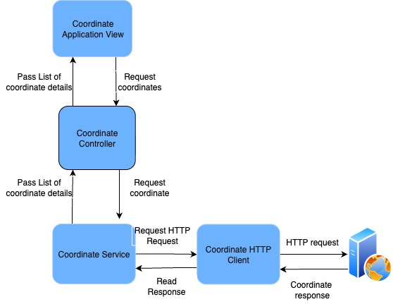
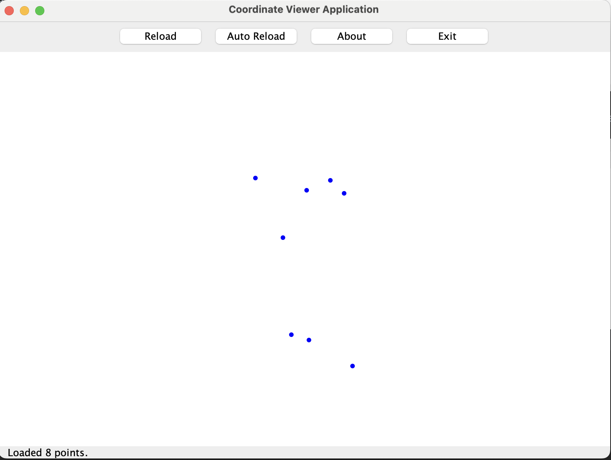
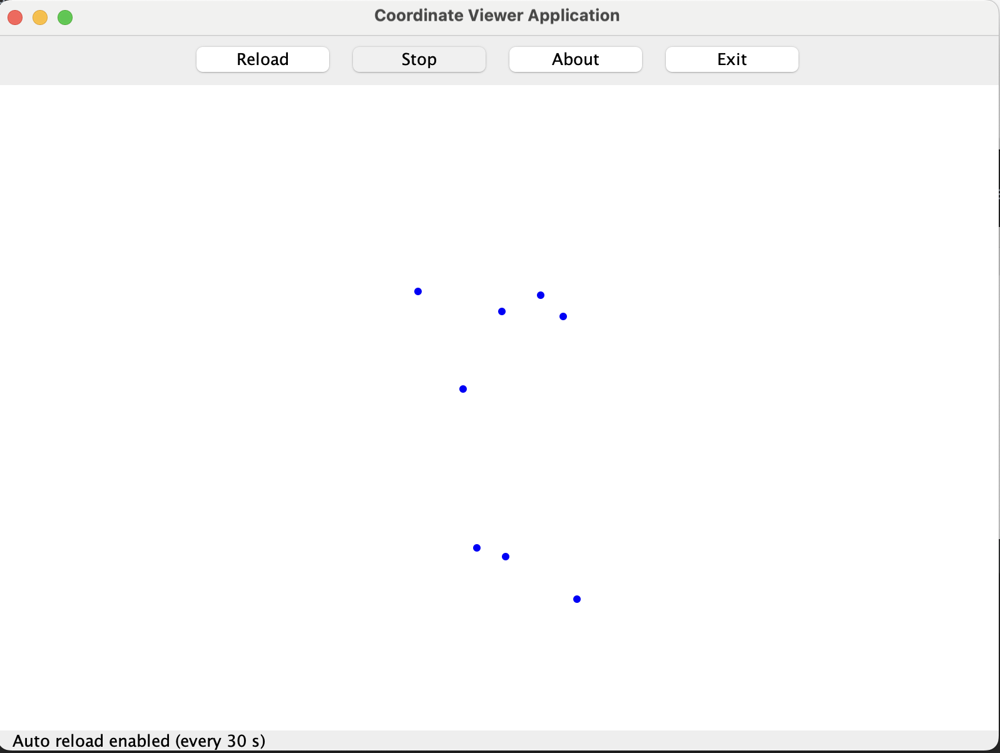
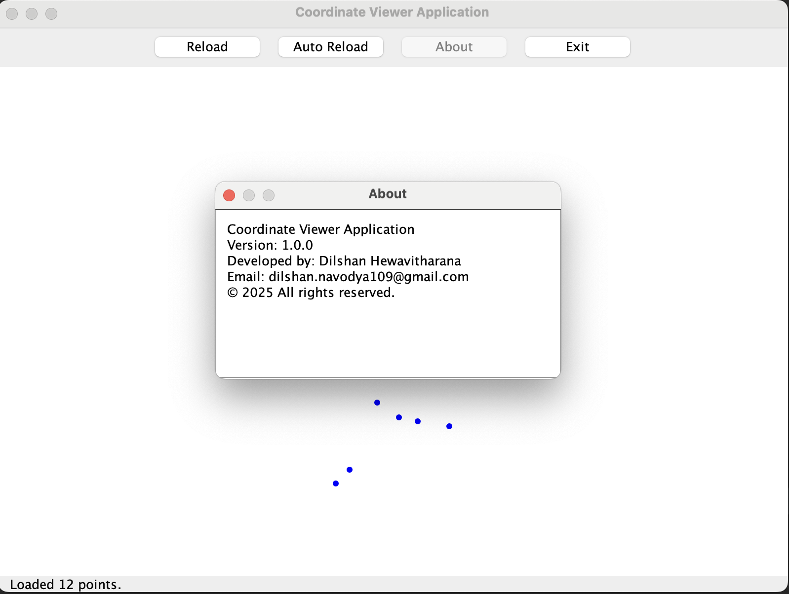
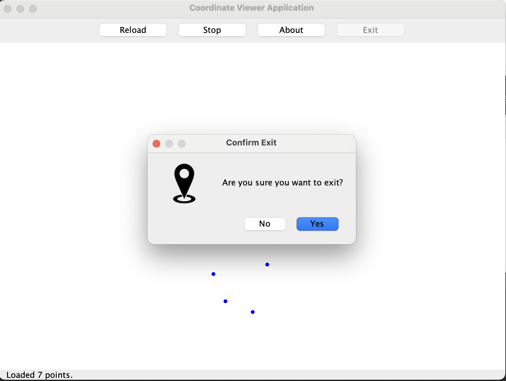

# Coordinate Viewer Application

A desktop application built with **Java 21** and **Swing**, designed to visualize coordinate data fetched from a
web server.  
It demonstrates modular architecture, dependency injection, background threading, and clean Java development practices.

---

## Running the Application

Prerequisites

- Java 21
- Maven

### Build

```
mvn clean package
```

### Run

```
java -jar target/CoordinateViewer-1.0.0.jar
```

---

## Features

- Fetches coordinate data dynamically from a server
- Displays scaled coordinates on a 2D map
- Shows labels when hovering over points
- Supports manual **and automatic reload** (every 30 s)
- Status bar updates while fetching
- “About” dialog with author contact details
- Retry mechanism for transient network errors
- Structured logging with `java.util.logging`

---

## Tech Stack

| Component    | Technology                     |
|--------------|--------------------------------|
| Language     | Java 21                        |
| UI Framework | Swing                          |
| Networking   | `java.net.http.HttpClient`     |
| Logging      | `java.util.logging`            |
| Build Tool   | Maven                          |
| Architecture | MVC-inspired modular structure |

---

## Architecture Overview
The project follows a **modular MVC-inspired** design:

High level design diagram




## Layer Overview

| Layer                 | Description                                                      |
|-----------------------|------------------------------------------------------------------|
| **CoordinateViewApp** | Application startup and main entry point                         |
| **config**            | Centralized configuration and providers (e.g., HttpClient)       |
| **model**             | Domain models and exceptions                                     |
| **service**           | Business logic for fetching and parsing coordinate data          |
| **view**              | Swing-based user interface (Frame, Panels, Dialogs)              |
| **util**              | Shared utilities for validation, retry logic and logger handling |
| **controller**        | Mediates between view and service layers                         |
| **test**              | Comprehensive unit tests for each component                      |

---

## Design Highlights

- **Loose Coupling** – dependencies injected via constructors
- **Responsive UI** – background operations handled by `SwingWorker`
- **RetryExecutor** – configurable retry with back-off for network calls
- **AppConfig** – centralized project configuration management
- **CoordinateTransform** – dynamically scales coordinates to fit panel size

---

## Data Format (Web server)

The coordinate data is retrieved from a web server:

```
# X, Y, Label
289, 190, ST-1130
393, 319, ST-656
137, -319, ST-1354
92, 1037, ST-697
```

Lines starting with # are ignored.
Each line defines one coordinate point.

---

## Configuration
Edit `src/main/resources/application.properties`:
```
data.source.url=http://host.com/coordinates.txt
retry.maxAttempts=3
retry.baseDelayMillis=500
auto.reload.interval.ms=30000
```

Automatically reloads coordinates every 30 seconds. Both the reload interval and maximum retry attempts are configurable through the `application.properties` file.

---

### Error Handling
- Automatic retries on IOException using RetryExecutor
- User-friendly dialogs for unrecoverable errors
- Detailed info and warning logs

---
### User interface screenshots for selected scenarios

- Loaded coordinates to the **UI**



- Click `Auto Reload` toggle button to enable automatic reload functionality



- Click `About` button to open application information dialog box



- Click `Exit` button to exit the application




---
### Contact Details
- Author: Dilshan Hewavitharana
- Email: dilshan.navodya109@gmail.com

